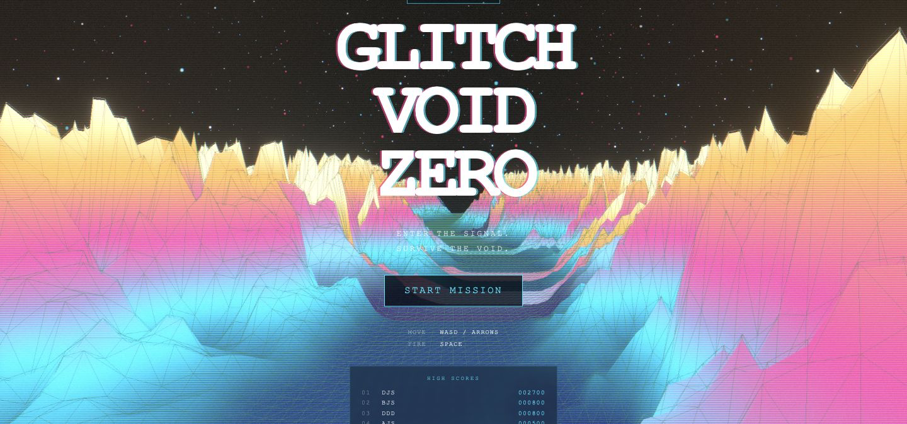
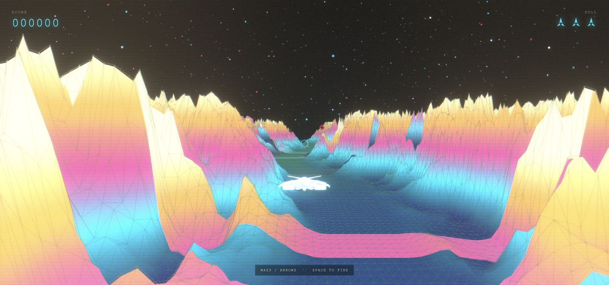

<div align="center">

# GLITCH VOID ZERO

**Enter the signal. Survive the void.**

A browser-based 3D arcade shooter set above a shifting neon landscape.
Built with React, Three.js, and custom GLSL shaders.

[**Play the live demo →**](https://glitch-void-zero.vercel.app/) · [Source code](https://github.com/Dsaar/Glitch-Void-Zero)


</div>



## Overview

Glitch Void Zero combines arcade survival gameplay with a retro digital aesthetic. Pilot a spaceship through a procedural landscape, destroy incoming enemies, and collect power-ups as the pace increases. Bloom, chromatic aberration, scanlines, and animated terrain give the world its glitch-inspired character.

The project brings together real-time 3D rendering, physics-based collision detection, responsive game UI, and custom shader programming in a single React application.

## Features

- **3D arcade combat** — steer a GLB spaceship, aim with an on-screen reticle, and fire projectiles at incoming enemies.
- **Escalating difficulty** — enemies move faster and spawn more frequently as a run progresses.
- **Power-up pickups** — collect rapid fire, a speed boost, or a shield from defeated enemies.
- **Procedural neon terrain** — custom vertex and fragment shaders animate a landscape with solid and wireframe layers.
- **CRT-inspired effects** — bloom, RGB separation, scanlines, and digital grain respond to the evolving glitch state.
- **Desktop and touch input** — keyboard controls on desktop; a virtual joystick and dedicated fire button on touch devices.
- **Complete mission loop** — title screen, live score and hull indicators, power-up HUD, game-over screen, and instant restart.

## Gameplay



*Screenshots captured from the [live demo](https://glitch-void-zero.vercel.app/).*

Select **Start Mission**, line up incoming targets, and survive for as long as you can. Each destroyed enemy earns **100 points**. You begin with **three lives**; losing all three ends the mission. Enemy speed and spawn frequency increase over time.

| Action | Desktop | Touch devices |
| --- | --- | --- |
| Move | WASD or arrow keys | Drag the virtual joystick |
| Fire | Hold Space | Hold the Fire button |
| Start / restart | Click the mission button | Tap the mission button |

| Power-up | Effect |
| --- | --- |
| Rapid fire | Increases firing rate for 10 seconds |
| Speed boost | Increases movement speed for 10 seconds |
| Shield | Absorbs one enemy collision |

## Technical highlights

### Rendering and visual effects

[GlitchTerrain.jsx](src/components/glitch/GlitchTerrain.jsx) renders a shared plane geometry with separate solid and wireframe shader materials. Frame updates drive time, terrain offset, and glitch intensity through uniforms, while the terrain stays positioned ahead of the camera. The custom GLSL lives in [terrainShaders.js](src/components/glitch/terrainShaders.js).

[Effects.jsx](src/components/glitch/Effects.jsx) composes bloom, chromatic aberration, scanlines, and noise. Effect settings sample the shared glitch state at 10 Hz, limiting React updates while the scene continues animating through the render loop.

### Game state and collision handling

[gameStore.js](src/components/game/gameStore.js) uses Zustand for mission phases, score, lives, and entity collections. Mutable input, player, and power-up state support frame-by-frame reads without requiring React renders for every movement update.

Rapier kinematic bodies and sensor colliders handle gameplay intersections. Projectile hits remove enemies, award points, create explosions, and can spawn power-ups. [EnemySpawner.jsx](src/components/game/EnemySpawner.jsx) controls the difficulty ramp and seeds a new pseudo-random spawn sequence for each run.

### Assets and input

[ShipModel.jsx](src/components/game/ShipModel.jsx) preloads the spaceship model, centers it using its bounding box, and normalizes its scale. Keyboard and pointer input feed the same player controller, with touch controls displayed when a touch device is detected.

## Tech stack

| Technology | Role |
| --- | --- |
| React 19 | Application composition and game UI |
| Three.js + React Three Fiber | WebGL rendering and frame-based scene updates |
| React Three Drei | GLB loading and model cloning |
| React Three Rapier | Physics integration and collision sensors |
| GLSL | Procedural terrain and glitch shading |
| React Three Postprocessing | Full-screen visual effects |
| Zustand | Shared game state |
| Vite 8 | Development server and production bundling |
| ESLint | Static code analysis |
| Vercel | Live demo hosting |

## Run locally

**Requirements:** Node.js **20.19+ on the 20.x line, or 22.12+**, npm, and a browser with WebGL support and hardware acceleration enabled.

```bash
git clone https://github.com/Dsaar/Glitch-Void-Zero.git
cd Glitch-Void-Zero
npm ci
npm run dev
```

Open the local URL printed by Vite. The app runs entirely in the browser; no backend service or environment variables are required.

### Available commands

| Command | Purpose |
| --- | --- |
| `npm run dev` | Start the development server |
| `npm run build` | Create the production build in `dist/` |
| `npm run preview` | Serve the production build locally |
| `npm run lint` | Run ESLint |

To preview a production build:

```bash
npm run build
npm run preview
```

## Project structure

```text
Glitch-Void-Zero/
├── docs/screenshots/           # README captures from the live app
├── public/
│   └── models/                # Spaceship GLB asset
├── src/
│   ├── App.jsx                # Canvas, lighting, world, and UI composition
│   ├── main.jsx               # React entry point
│   ├── index.css              # Game UI and responsive styling
│   └── components/
│       ├── game/              # Entities, physics, state, HUD, and input
│       └── glitch/            # Terrain, shaders, starfield, and effects
├── index.html
├── package.json
└── vite.config.js
```

## Third-Party Assets

**Spaceship:** "Intergalactic Spaceship in Blender 2.8 Eevee"\
Created by **Dennis Haupt (3DHaupt)**\
Licensed under **Creative Commons Attribution-NonCommercial (CC BY-NC)**\
Source: [BlendSwap](https://www.blendswap.com/blend/22854)

Model file: `public/models/Intergalactic Spaceship_Blender_2.79b_BI.glb`.

This is a personal, non-commercial project. The spaceship model is a third-party asset and is not original project content.

## Author

Created by [Dsaar](https://github.com/Dsaar).

[Play Glitch Void Zero](https://glitch-void-zero.vercel.app/) · [Report an issue](https://github.com/Dsaar/Glitch-Void-Zero/issues)
