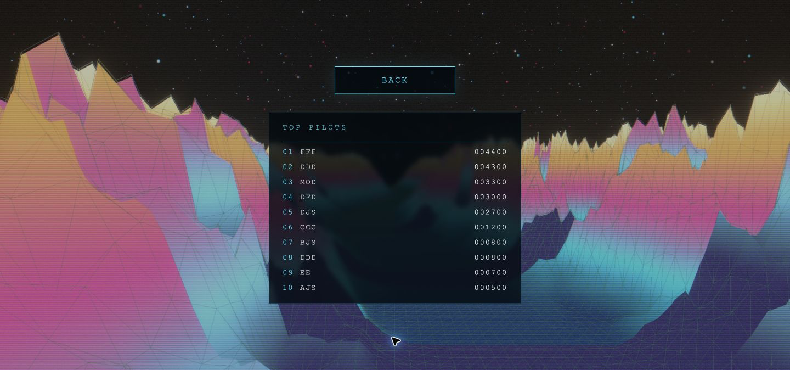
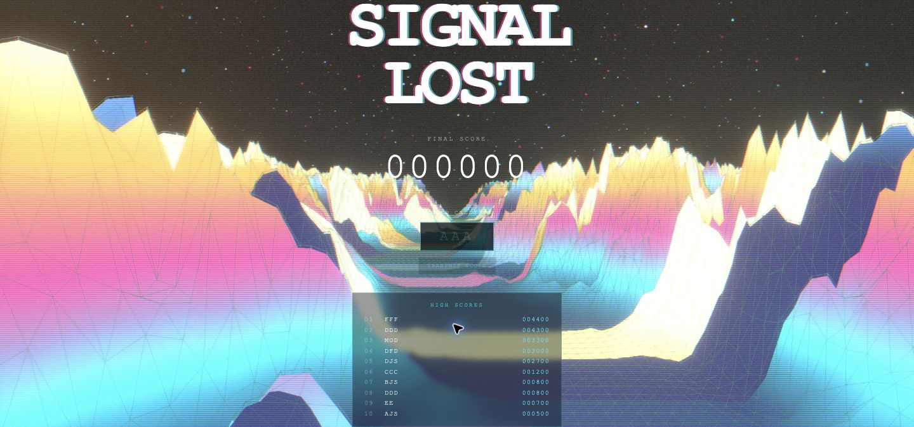

<div align="center">

# GLITCH VOID ZERO

**Enter the signal. Survive the void.**

A browser-based 3D arcade shooter set above a shifting neon landscape.
Built with React, Three.js, custom GLSL shaders, and a MongoDB-backed leaderboard.

[**Play the live demo →**](https://glitch-void-zero.vercel.app/) · [Source code](https://github.com/Dsaar/Glitch-Void-Zero)


</div>


## Overview

Glitch Void Zero combines arcade survival gameplay with a retro digital aesthetic. Pilot a spaceship through a procedural landscape, destroy incoming enemies, and collect power-ups as the pace increases. Bloom, chromatic aberration, scanlines, and animated terrain give the world its glitch-inspired character.

The project brings together real-time 3D rendering, physics-based collision detection, responsive game UI, and custom shader programming with a Node.js API for persistent high scores shared across browsers and devices.

## Features

- **3D arcade combat** — steer a GLB spaceship, aim with an on-screen reticle, and fire projectiles at incoming enemies.
- **Neon spaceship** — a cyan emissive tint makes the ship glow through the existing bloom effect while retaining its base textures.
- **Shared high scores** — a MongoDB-backed top-ten ranking has its own **Top Pilots** screen, accessible through the Leaderboard button below Start Mission. High scores also appear after a mission ends.
- **Escalating difficulty** — enemies move faster and spawn more frequently as a run progresses.
- **Power-up pickups** — collect rapid fire, a speed boost, or a shield from defeated enemies.
- **Procedural neon terrain** — custom vertex and fragment shaders animate a landscape with solid and wireframe layers.
- **CRT-inspired effects** — bloom, RGB separation, scanlines, and digital grain respond to the evolving glitch state.
- **Desktop and touch input** — keyboard controls on desktop; a virtual joystick and dedicated fire button on touch devices.
- **Complete mission loop** — title screen, live score and ship-shaped hull indicators, power-up HUD, callsign entry, score submission feedback, and instant restart.

## Gameplay


*Screenshots captured from the current project running locally. Leaderboard entries reflect the scores visible at capture time.*

Select **Start Mission**, line up incoming targets, and survive for as long as you can. Each destroyed enemy earns **100 points**. You begin with **three lives**; losing all three ends the mission. Enemy speed and spawn frequency increase over time.

| Action | Desktop | Touch devices |
| --- | --- | --- |
| Move | WASD or arrow keys | Drag the virtual joystick |
| Fire | Hold Space | Hold the Fire button |
| Start / restart | Click the mission button | Tap the mission button |

| Power-up | Effect |
| --- | --- |
| Rapid fire | Increases firing rate for 10 seconds |
| Speed boost | Increases movement speed for 10 seconds |
| Shield | Absorbs one enemy collision |

### Browse the leaderboard



Choose **Leaderboard** beneath **Start Mission** to open the dedicated rankings screen. Select **Back**, or press **Escape**, to return to the menu. Opening this screen refreshes the rankings; if loading fails, use **Retry**. Navigation keeps the animated world running in the background.

### Record your score



After a mission ends, enter a **1–3 character callsign** using letters or digits and select **Transmit Score**. Callsigns are normalized to uppercase. A successful submission is stored in MongoDB; the leaderboard displays the ten highest scores, with earlier submissions first when scores tie. Loading, saving, and failure states appear in the UI, and failed requests can be retried.

## Technical highlights

### Rendering and visual effects

[GlitchTerrain.jsx](src/components/glitch/GlitchTerrain.jsx) renders a shared plane geometry with separate solid and wireframe shader materials. Frame updates drive time, terrain offset, and glitch intensity through uniforms, while the terrain stays positioned ahead of the camera. The custom GLSL lives in separate [vertex](src/components/glitch/shaders/terrain/vertex.glsl) and [fragment](src/components/glitch/shaders/terrain/fragment.glsl) files, imported through Vite’s `?raw` loader. [NeonStarfield.jsx](src/components/glitch/NeonStarfield.jsx) likewise uses dedicated [starfield shaders](src/components/glitch/shaders/starfield).

[GlitchEffects.jsx](src/components/glitch/GlitchEffects.jsx) composes bloom, chromatic aberration, scanlines, and noise. Effect settings sample the shared glitch state at 10 Hz, limiting React updates while the scene continues animating through the render loop.

### Game state and collision handling

[useGameStore.js](src/hooks/useGameStore.js) uses Zustand for mission phases, score, lives, and entity collections. Frame-by-frame player position, invulnerability, and power-up timers live separately in [gameState.js](src/state/gameState.js). Input and visual state are held in [touchState.js](src/state/touchState.js) and [glitchState.js](src/state/glitchState.js), allowing render-loop reads without React updates for every movement. The store manages `menu`, `playing`, and `gameover`; the home/leaderboard view is local UI state in [GameUI.jsx](src/components/game/ui/GameUI.jsx).

Rapier kinematic bodies and sensor colliders handle gameplay intersections. Projectile hits remove enemies, award points, create explosions, and can spawn power-ups. [EnemySpawner.jsx](src/components/game/EnemySpawner.jsx) controls the difficulty ramp and seeds a new pseudo-random spawn sequence for each run.

### Assets and input

[ShipModel.jsx](src/components/game/entities/ShipModel.jsx) preloads the spaceship model, centers it using its bounding box, and normalizes its scale. It clones the materials before applying cyan emission (`#00e5ff`, intensity `1.5`), preserving the cached GLB and its base textures. `SHIP_GLOW_COLOR` and `SHIP_GLOW_INTENSITY` control the tint and strength. Keyboard and pointer input feed the same player controller, with touch controls displayed when a touch device is detected.

### Persistent leaderboard

[Leaderboard.jsx](src/components/game/ui/Leaderboard.jsx) renders rankings and loading/error states. [leaderboardApi.js](src/services/leaderboardApi.js) handles shared API requests and request timeouts. [server/leaderboard.js](server/leaderboard.js) validates submissions, while [server/mongodb.js](server/mongodb.js) reuses a database connection and creates the ranking index on first use.

| Endpoint | Behavior |
| --- | --- |
| `GET /api/leaderboard` | Returns up to ten entries ordered by score descending, then submission time and ID ascending |
| `POST /api/leaderboard` | Accepts JSON `{ "name": "ACE", "score": 1200 }`; returns `201` with `{ "saved": true }` |

The API accepts 1–3 alphanumeric callsign characters and nonnegative safe-integer scores, limits request bodies to 1 KB, and reports unavailable database connections with `503`. Vite serves the endpoint during development and preview; [api/leaderboard.js](api/leaderboard.js) exposes it as a Vercel function in production.

## Tech stack

| Technology | Role |
| --- | --- |
| React 19 | Application composition and game UI |
| Three.js + React Three Fiber | WebGL rendering and frame-based scene updates |
| React Three Drei | GLB loading and model cloning |
| React Three Rapier | Physics integration and collision sensors |
| GLSL | Procedural terrain and glitch shading |
| React Three Postprocessing | Full-screen visual effects |
| Zustand | Shared game state |
| Vite 8 | Development server and production bundling |
| ESLint | Static code analysis |
| MongoDB + Node.js driver | Persistent shared leaderboard and ranking index |
| Node.js | Leaderboard API and built-in test runner |
| Vercel | Frontend hosting and serverless leaderboard endpoint |

## Run locally

**Requirements:** Node.js **20.19+ on the 20.x line, or 22.12+**, npm, and a browser with WebGL support and hardware acceleration enabled.

```bash
git clone https://github.com/Dsaar/Glitch-Void-Zero.git
cd Glitch-Void-Zero
npm ci
```

Create a `.env` file in the project root with your server-side MongoDB connection string. For example, for a local database:

```dotenv
MONGODB_URI=mongodb://127.0.0.1:27017/glitch_void_zero
```

Then start the app:

```bash
npm run dev
```

Open the local URL printed by Vite. Vite also serves `/api/leaderboard` locally (including `npm run preview`). Restart the server after changing `.env`.

### MongoDB leaderboard setup

1. Create a MongoDB database, locally or on Atlas. For Atlas, create a database user and allow your development/deployment server to connect through the cluster network access settings.
2. Configure `.env`: `MONGODB_URI` is your connection string. Include the database name in its path (for example, `/glitch_void_zero?retryWrites=true&w=majority`); if omitted, the server uses `glitch_void_zero`. URL-encode special characters in the connection-string username/password.
3. The server creates the `leaderboard` collection and ranking index on first use. The database user needs permissions to read, insert, and create indexes in that database.
4. For Vercel, add `MONGODB_URI` in the project's environment settings for the appropriate environments, then redeploy. The `api/leaderboard.js` function serves the same endpoint in production. A static-only host needs a Node backend to serve this endpoint.

`.env` is ignored by Git. Keep real connection strings out of source control and documentation. Never use the `VITE_` prefix for MongoDB credentials: that would expose them to the browser.

Scores are stored centrally and the ten highest scores are displayed, with earlier submissions first for ties. Existing browser-local scores are not migrated. Loading or database failures appear in the UI; failed saves can be retried. The API validates callsigns and scores, but scores are still supplied by the browser; this is not an anti-cheat system. A timed-out save may already have reached the database, so retrying can create a duplicate.

Implementation references: [MongoDB Node driver](https://www.mongodb.com/docs/drivers/node/current/) and [Vercel Node functions](https://vercel.com/docs/functions/runtimes/node-js).

### Available commands

| Command | Purpose |
| --- | --- |
| `npm run dev` | Start the development server |
| `npm run build` | Create the production build in `dist/` |
| `npm run preview` | Serve the production build locally |
| `npm run lint` | Run ESLint |
| `npm test` | Run API validation and error-handling tests |

To preview a production build:

```bash
npm run build
npm run preview
```

## Project structure

```text
Glitch-Void-Zero/
├── api/leaderboard.js          # Vercel function entry point
├── server/
│   ├── leaderboard.js         # Validation and ranking queries
│   ├── mongodb.js             # Database connection and index
│   └── leaderboard.test.js    # API tests
├── docs/screenshots/          # Current app screenshots
├── public/models/             # Third-party spaceship GLB
├── src/
│   ├── App.jsx                # Canvas, world, lighting, and UI
│   ├── main.jsx               # React entry point
│   ├── index.css              # HUD, menus, and responsive styles
│   ├── hooks/                 # Zustand store, keyboard, touch detection
│   ├── state/                 # Mutable game, touch, and glitch state
│   ├── services/              # Leaderboard API client
│   └── components/
│       ├── game/
│       │   ├── GameScene.jsx  # Physics and entity composition
│       │   ├── FlightRig.jsx  # Camera and flight motion
│       │   ├── EnemySpawner.jsx
│       │   ├── entities/      # Ship, enemies, projectiles, pickups, explosions
│       │   ├── controls/      # Joystick and fire button
│       │   └── ui/            # Menus, leaderboard, HUD, and reticle
│       ├── glitch/
│       │   ├── GlitchTerrain.jsx
│       │   ├── NeonStarfield.jsx
│       │   ├── GlitchEffects.jsx
│       │   └── shaders/       # Terrain and starfield vertex/fragment GLSL
│       └── ui/                # Shared loading overlay
├── index.html
├── package.json
└── vite.config.js             # React and local leaderboard middleware
```

## Third-Party Assets

**Spaceship:** "Intergalactic Spaceship in Blender 2.8 Eevee"\
Created by **Dennis Haupt (3DHaupt)**\
Licensed under **Creative Commons Attribution-NonCommercial (CC BY-NC)**\
Source: [BlendSwap](https://www.blendswap.com/blend/22854)

Model file: `public/models/Intergalactic Spaceship_Blender_2.79b_BI.glb`.

This is a personal, non-commercial project. The spaceship model is a third-party asset and is not original project content.

## Author

Created by [Dsaar](https://github.com/Dsaar).

[Play Glitch Void Zero](https://glitch-void-zero.vercel.app/) · [Report an issue](https://github.com/Dsaar/Glitch-Void-Zero/issues)
